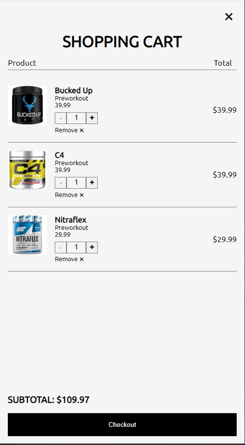

# The Odin Project - Shopping Cart Project

This is a solution to the [Shopping Cart Project](https://www.theodinproject.com/lessons/node-path-javascript-shopping-cart). 

## Table of contents

- [Overview](#overview)
  - [The challenge](#the-challenge)
  - [Screenshot](#screenshot)
  - [Links](#links)
- [My process](#my-process)
  - [Built with](#built-with)
  - [What I learned](#what-i-learned)
  - [Continued development](#continued-development)
  - [Useful resources](#useful-resources)
- [Author](#author)


## Overview

### The challenge

Users should be able to:

- Create a navigation bar using react routers
- See a sticky bar, which displays the number of items currently in the cart. You should also have a button next to it where you can go to the cart to checkout and pay
- Allow users to increment and decrement product
- Show the total amout for combine product cost
- Use react testing library


### Screenshot




### Links

- Solution URL: [https://github.com/Kevo760/Shopping-Cart-React-TheOdinProject]
- Live Site URL: [https://Kevo760.github.io/Shopping-Cart-React-TheOdinProject/]

## My process

### Built with

- Flexbox
- CSS Grid
- [React](https://reactjs.org/) - JS library


### What I learned

I learned on how to use react dom router, specifically that you can use the Router and Link tags to wrap over divs.
I was having a hard time trying to figure out how you can click a product and have it link to its own page, but later figuring out that you can wrap the Link inside the div, (Example 1). I also had a hard time figuring out how I could test the component specifically that it was wrapped on the link, which was throwing an error on react testing. I figured out you can use a wrapper and pass MemoryRouter to make it not throw an error, (Example 2).


```js
// Example 1
<Link to={product.link} className='link'>
    <div className='product-preview'>
        
        <span className='preview-name'>{product.name}</span>
        <span className='preview-type'>{product.type}</span>
        <span className='preview-price'>${product.price}</span>
    </div>
    </Link>

// Example 2
    test('Product image renders correctly', () => {
        render(<ProductPreview product={product}/>, {
            wrapper: MemoryRouter
        })
        const productImg = screen.getByRole('img');
        expect(productImg).toBeInTheDocument();
    })
```


### Continued development

I feel like I got the idea of how the React router works, but would like to work on projects that will allow me to go more in dept. I would also like to learn more on React testing since I do believe using Test Driven Development makes everything easier in the long run when finishing the app due encontering less bugs. I am also getting better on understanding the useState method and useEffect. 

### Useful resources

- [Stackoverflow](https://www.stackoverflow.com) - This helped me figure out how I can test components that have a Link wrapper, helped me understand and create some of the functions I created. 
- [React Testing Library](https://testing-library.com/) - This website helped me understand the basics of React Testing. 


## Author

- Email - [Kevin David](kevin760g@gmail.com)
- Twitter - [@CoderKevo](https://www.twitter.com/CoderKevo)


